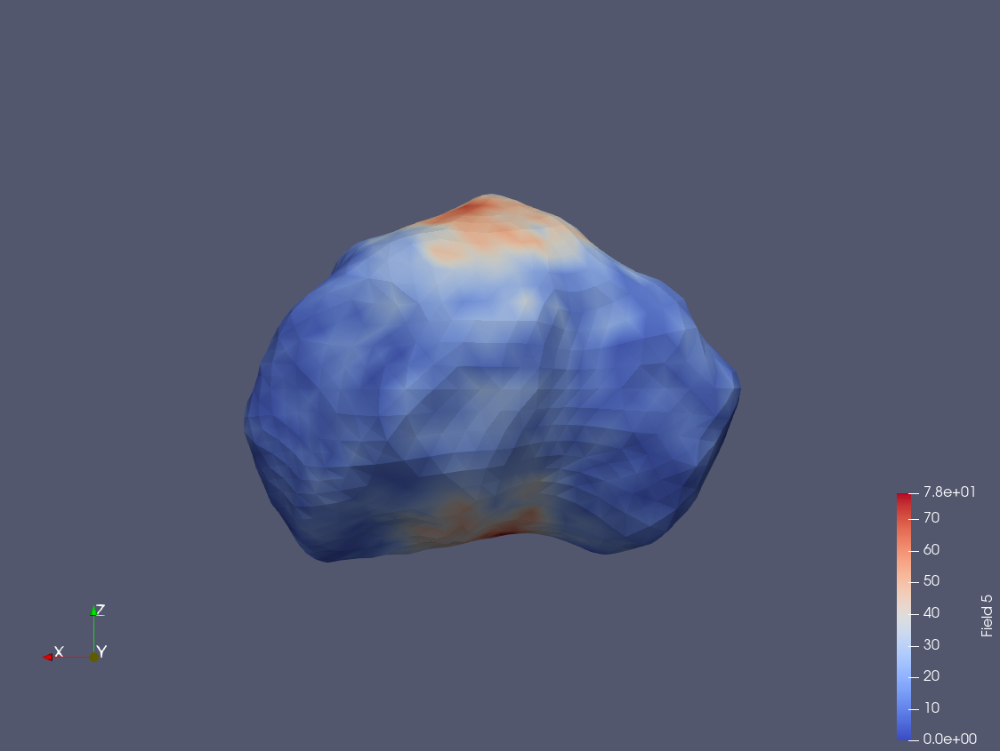

.. _ColorSpots:

##########
ColorSpots
##########

ColorSpots takes as input a shape model and a file containing (x, y, z, value), 
or (lat, lon, value).  It writes out the mean and standard deviation of values 
within a specified range for each facet.

.. include:: ../toolDescriptions/ColorSpots.txt
    :literal:

********
Examples
********

Download the :download:`Apophis<./support_files/apophis_g_15618mm_rdr_obj_0000n00000_v001.obj>` 
shape model and the :download:`info<./support_files/xyzrandom.txt>` file containing 
cartesian coordinates and a random value.

Run ColorSpots:

::

    ColorSpots -obj apophis_g_15618mm_rdr_obj_0000n00000_v001.obj -xyz \ 
    -info xyzrandom.txt -outFile apophis_value_at_vertex.csv -noWeight \ 
    -allFacets -additionalFields n -searchRadius 0.015 -writeVertices 

The first few lines of apophis_value_at_vertex.csv look like:

::

    % head apophis_value_at_vertex.csv
    0.000000e+00, 0.000000e+00, 1.664960e-01, -3.805764e-02, 5.342315e-01, 4.000000e+01
    1.589500e-02, 0.000000e+00, 1.591030e-01, 6.122849e-02, 6.017192e-01, 5.000000e+01
    7.837000e-03, 1.486800e-02, 1.591670e-01, -6.072964e-03, 5.220682e-01, 5.700000e+01
    -7.747000e-03, 1.506300e-02, 1.621040e-01, 9.146163e-02, 5.488631e-01, 4.900000e+01
    -1.554900e-02, 0.000000e+00, 1.657970e-01, -8.172811e-03, 5.270302e-01, 3.400000e+01
    -7.982000e-03, -1.571100e-02, 1.694510e-01, -2.840524e-02, 5.045911e-01, 3.900000e+01
    8.060000e-03, -1.543300e-02, 1.655150e-01, 3.531959e-02, 5.464390e-01, 4.900000e+01
    3.179500e-02, 0.000000e+00, 1.515820e-01, -1.472434e-02, 5.967265e-01, 5.400000e+01
    2.719700e-02, 1.658200e-02, 1.508930e-01, -9.050683e-03, 5.186966e-01, 4.700000e+01
    1.554100e-02, 2.901300e-02, 1.530770e-01, -7.053547e-02, 4.980369e-01, 7.000000e+01

The columns are:

.. list-table:: ColorSpots Vertex output
   :header-rows: 1

   * - Column
     - Value
   * - 1
     - X
   * - 2
     - Y
   * - 3
     - Z
   * - 4
     - mean value in region
   * - 5
     - standard deviation in region
   * - 6
     - number of points in region

    This image shows the number of points in the region at each vertex.

