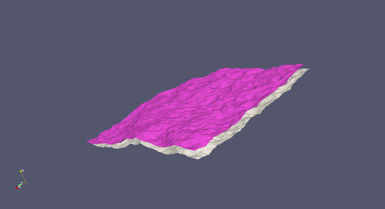
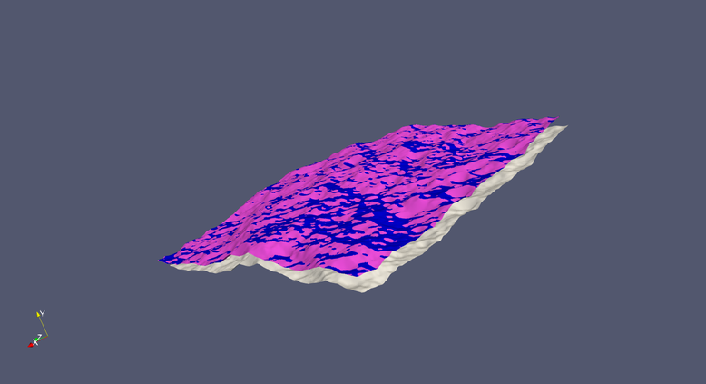
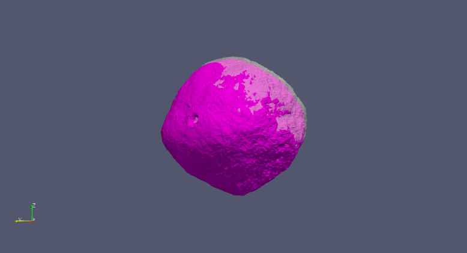
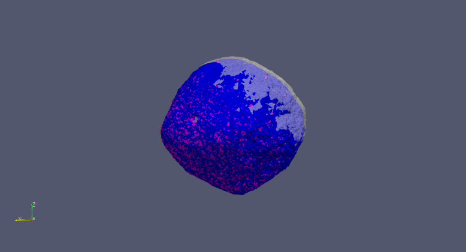

.. _CompareOBJ:

##########
CompareOBJ
##########

*****
Usage
*****

CompareOBJ reports the differences between two OBJ shape files.  It can also find the 
optimal rotation and/or translation to best fit one model to the other.

.. include:: ../toolDescriptions/CompareOBJ.txt
    :literal:

********
Examples
********

Local Model Comparison
######################

Download the :download:`reference<./support_files/EVAL20_wtr.obj>` and :download:`comparison<./support_files/EVAL20.obj>` 
shape models.  You can view them in a tool such as 
`ParaView<https://www.paraview.org/>`.

   This image shows the reference (pink) and comparison (grey) shape models.

Run CompareOBJ to find the optimal transform to align the comparison with the reference:
::

    CompareOBJ -computeOptimalRotationAndTranslation -model F3H-1/EVAL20.obj \ 
    -reference F3H-1/EVAL20_wtr.obj -computeVerticalError verticalError.txt \
    -saveOptimalShape optimal.obj -savePlateDiff plateDiff.txt -savePlateIndex plateIndex.txt

The screen output is
::

    Translation: 4.62205663e-04,7.83045454e-04,-2.29286045e-04
    Rotation quaternion: 9.99865353e-01,5.09597815e-03,1.50904931e-02,3.94767030e-03
    Rotation angle (degrees) and axis: 1.88048990e+00,3.10547953e-01,9.19611823e-01,2.40570289e-01
    Center of rotation: -2.80636488e-02,2.59626158e-01,-3.68889950e-02
    4x4 Transformation matrix:
    9.99513386e-01  -7.74047588e-03   3.02171569e-02   4.62205663e-04
    8.04807917e-03   9.99916894e-01  -1.00714394e-02   7.83045454e-04
    -3.01366880e-02   1.03097286e-02   9.99492616e-01  -2.29286045e-04
    0.00000000e+00   0.00000000e+00   0.00000000e+00   1.00000000e+00
    Using 319740 of 319740 points (excluding 0.0% largest distances)
    Min Distance:              2.7101076120651766E-11
    Max Distance:              1.3343678431994644E-5
    Mean Distance:             3.6381274026976392E-6
    Mean Square Distance:      1.9828385012474584E-11
    Root Mean Square Distance: 4.452907478544168E-6
    Mean Vertical Distance:             3.643513246881461E-6
    Mean Square Vertical Distance:      1.9878841624828557E-11
    Root Mean Square Vertical Distance: 4.458569459459901E-6
    Direction perpendicular to plane: 0.1308102982873679 0.9899926953698763 0.05294458401250757
    Magnitude of projection perpendicular to plane: 8.235310856890277E-4
    Projection vector of translation parallel to plane: 3.544793163646046E-4 -3.2244305568425196E-5 -2.728875559193712E-4
    Magnitude of projection vector of translation parallel to plane: 4.485118718022471E-4
    319740 plates used in error calculation out of 320000 total in the shape model

   This image shows the reference (pink), comparison (grey), and transformed comparison (blue) shape models.

Global Model Comparison
#######################

Use the :download:`low resolution Bennu<./support_files/Bennu49k.obj>` shape model for this 
example.  We will use the ShapeFormatConverter tool to create a transformed 
model for comparison:

::

    ShapeFormatConverter -input Bennu/Bennu49k.obj -output BennuComparison.obj \
    -rotate 5,0,0,1 -translate 0.01,-0.01,0.01

This rotates the shape model by 5 degrees about the z axis and then translates 
by the vector [0.01, -0.01, 0.01].  The units and frame are the same used in 
the OBJ file, namely km and IAU_BENNU.

   This image shows the reference (pink) and comparison (grey, 50% opacity) shape models.

Run CompareOBJ to find the optimal transform to align the comparison with the reference:

::

    CompareOBJ -computeOptimalRotationAndTranslation \
    -model BennuComparison.obj \
    -reference Bennu/Bennu49k.obj \
    -computeVerticalError CompareOBJ/terrasaur-verticalError.txt \
    -saveOptimalShape CompareOBJ/terrasaur-optimal.obj \
    -savePlateDiff CompareOBJ/terrasaur-plateDiff.txt \
    -savePlateIndex CompareOBJ/terrasaur-plateIndex.txt

The screen output is

::

    Translation: -9.96162524e-03,7.99729762e-03,-1.00000044e-02
    Rotation quaternion: 9.99048223e-01,-2.15657319e-08,-3.22625083e-08,4.36193625e-02
    Rotation angle (degrees) and axis: 4.99999715e+00,-4.94407314e-07,-7.39637317e-07,1.00000000e+00
    Center of rotation: -1.29539855e-02,-9.43799800e-03,8.39669000e-03
    4x4 Transformation matrix:
    9.96194702e-01  -8.71556932e-02  -6.63449701e-08  -9.96162524e-03
    8.71556932e-02   9.96194702e-01   4.02758721e-08   7.99729762e-03
    6.25822362e-08  -4.59049522e-08   1.00000000e+00  -1.00000044e-02
    0.00000000e+00   0.00000000e+00   0.00000000e+00   1.00000000e+00
    Using 49152 of 49152 points (excluding 0.0% largest distances)
    Min Distance:              0.0
    Max Distance:              3.563071622544315E-8
    Mean Distance:             7.04333531909585E-9
    Mean Square Distance:      7.536457599802241E-17
    Root Mean Square Distance: 8.681277325257063E-9
    Mean Vertical Distance:             7.043335319394247E-9
    Mean Square Vertical Distance:      7.536457599439208E-17
    Root Mean Square Vertical Distance: 8.681277325047973E-9
    Direction perpendicular to plane: 0.6497386220463811 0.7600912355533176 -0.010051699174815498
    Magnitude of projection perpendicular to plane: -2.9325978832850564E-4
    Projection vector of translation parallel to plane: -0.00977108302826207 0.00822020181894647 -0.010002952125253225
    Magnitude of projection vector of translation parallel to plane: 0.016220506549103512
    49152 plates used in error calculation out of 49152 total in the shape model

   This image shows the reference (pink), comparison (grey, 50% opacity), and transformed comparison (blue) shape models.