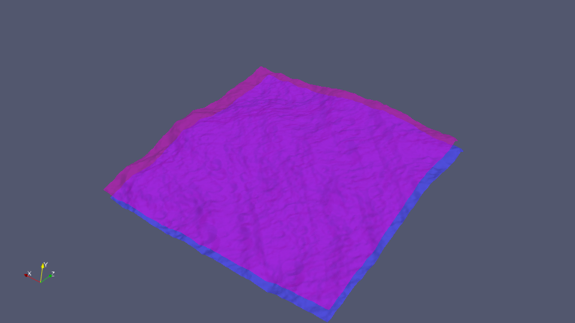
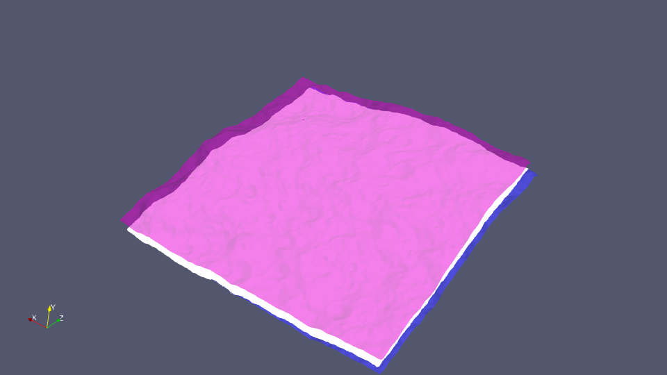

.. _PointCloudOverlap:

#################
PointCloudOverlap
#################

*****
Usage
*****

.. include:: ../toolDescriptions/PointCloudOverlap.txt
    :literal:

********
Examples
********
 
Download the :download:`reference<./support_files/EVAL20_wtr.obj>` and :download:`comparison<./support_files/EVAL20.obj>` 
shape models.  You can view them in a tool such as 
`ParaView <https://www.paraview.org/>`__.

   This image shows the reference (pink) and input (blue) shape models.

Run PointCloudOverlap:

::

    PointCloudOverlap -inputFile EVAL20.obj -referenceFile EVAL20_wtr.obj -outputFile overlap.vtk 

Note that OBJ is supported as an input format but not as an output format.

   The points in white are those in the input model that overlap the reference.

