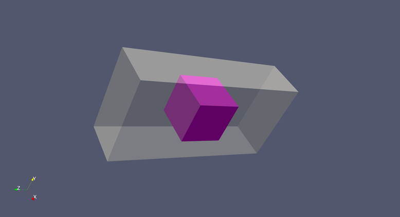
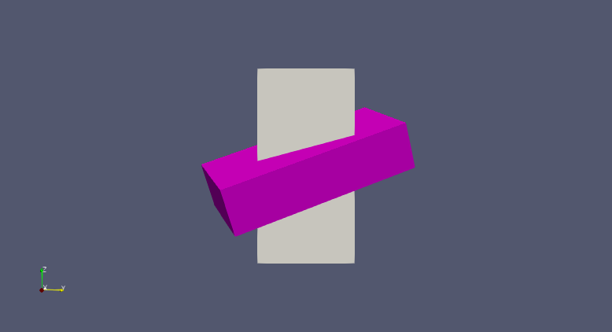

.. _ShapeFormatConverter:

####################
ShapeFormatConverter
####################

*****
Usage
*****

ShapeFormatConverter can transform and convert shape models.  Supported input formats are
icq, fits, llr, obj, pds, plt, ply, sbmt, stl, sum, or vtk.  Supported output formats are
obj, plt, sbmt, stl, sum, or vtk.

.. include:: ../toolDescriptions/ShapeFormatConverter.txt
    :literal:
  
********
Examples
********

Download :download:`rectangular_cuboid.obj <./support_files/rectangular_cuboid.obj>`.  This is a rectangular 
cuboid centered on the origin with dimension 2 in the X direction, 4 in the Y direction, 
and 8 in the Z direction.

Turn it into a cube and save as an STL file:

::

    ShapeFormatConverter -input rectangular_cuboid.obj -output cube.stl -scale 1,0.5,0.25

    This image shows the original shape and the resized cube (pink)

Rotate it by 90 degrees around (1, 1, 1):

::

    ShapeFormatConverter -input rectangular_cuboid.obj -output rotated.stl -rotate 90,1,1,1

    This image shows the original shape and the rotated shape (pink)

